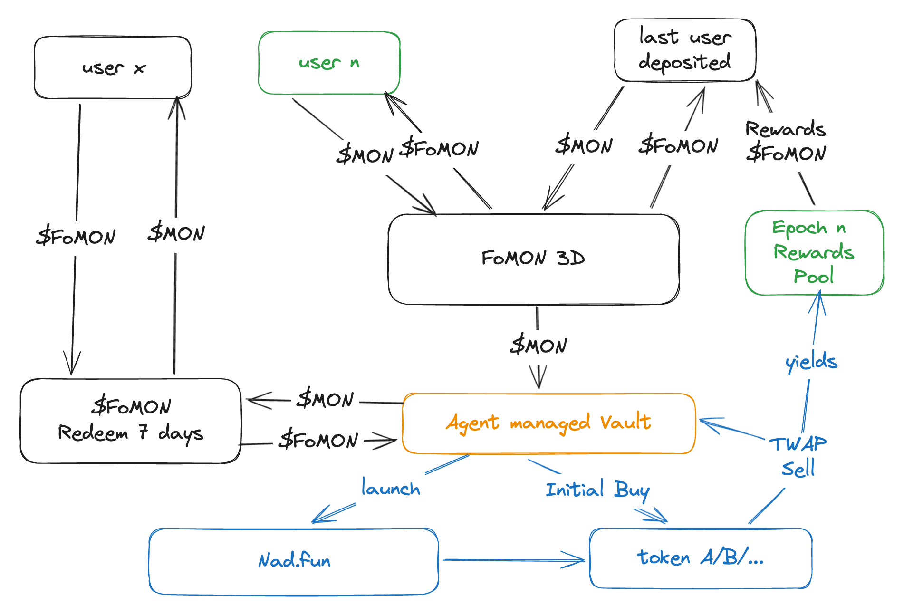

# FoMON3D

[中文版本](README.zh-CN.md)

FoMON3D is a trust-bootstrap protocol for AI trading capital on Monad.  
Our thesis: an AI Agent may be able to trade launchpad MEME assets, but most human capital providers do not trust an agent with direct discretionary funds on day one.  
FoMON3D solves this by using a game layer to bootstrap capital and attention into an Agent Treasury, making AI-driven treasury operations socially and economically viable.



## Monad Hackathon Submission

- Project name: `FoMON3D`
- Track: `Agent+Token Track`
- Network: Monad
- Team: FoMON3D
- Verifiable live demo on Monad testnet: Completed ([https://fomon3d.vercel.app/](https://fomon3d.vercel.app/))
- Demo video: [FoMON3D.mov](./FoMON3D.mov)
- Repository / code: https://github.com/realTaki/FoMON3D

## 1. What Problem We Solve

AI trading agents face a cold-start trust problem:
- Capability may exist, but trust from human LPs does not.
- Direct "send funds to AI and wait" products have high skepticism.
- Without initial pooled capital, an Agent Treasury cannot operate at meaningful scale.

FoMON3D turns this into a playable capital formation process:
- the game loop attracts participation and liquidity,
- the treasury share system keeps participants aligned after each round,
- and the Agent Treasury gets the working capital needed to run strategies.

## 2. Core Innovation

FoMON3D introduces a trust-to-capital conversion mechanism with two layers:
- Round layer (FOMO game): each valid deposit resets a 30s timer; the last depositor wins the round payout.
- Treasury layer (share system): deposits mint `$FoMON`, representing claims on treasury NAV and future upside.

In the updated flowchart, the central game module is shown as `FoMON 3D`, and capital is routed into an `Agent managed Vault` that executes launchpad strategy on Nad.fun with TWAP sell-outs.

This design reframes participation from pure gambling to staged trust-building:
- users join through a familiar game primitive,
- capital accumulates in a structured treasury,
- agent strategy is funded by a community-formed pool instead of blind upfront delegation.

Non-winning users are not forced into zero-sum loss: they can hold, redeem via queue, or trade (if liquidity exists).

## 3. Why Monad

FoMON3D requires very high interaction speed:
- Low latency for real-time timer races.
- Low fees for frequent small deposits.
- High throughput during peak contention.

Monad is the right execution environment for this interaction pattern.

## 4. How It Works

1. User deposits `$MON`.
2. Protocol mints `$FoMON` to user.
3. Timer resets (30s) on each valid deposit.
4. If timer reaches zero, last depositor wins the round reward.
5. Other users keep `$FoMON` and can:
- hold for treasury exposure,
- redeem to `$MON` through a 7-day queue.

## 5. Contract Architecture (Planned / In Progress)

- `GameRound`: timer, round state, winner settlement.
- `FoMONToken`: ERC-20 share token.
- `TreasuryVault`: deposits, NAV accounting, redeem queue.
- `StrategyAdapter`: strategy execution and risk controls.

## 6. Hackathon Contribution Clarity

Built by our team during this hackathon:
- FoMON3D game design and incentive model.
- Round + treasury hybrid architecture.
- Token flow and redemption model.
- Demo narrative and product documentation.

Open-source / external dependencies:
- Standard Solidity / EVM libraries (to be listed in final code release).
- Monad developer tooling.

## 7. Demo Guide for Judges

In the demo, we show:
- one full round lifecycle (deposit -> timer reset -> winner settlement),
- post-round user options (hold / redeem queue),
- treasury share logic (`$MON` <-> `$FoMON`),
- why this mechanic is uniquely suitable for Monad performance.

## 8. Roadmap

- `v0`: core contracts + local simulation.
- `v1`: Monad testnet deployment + playable frontend.
- `v2`: strategy/risk module hardening + public playtest.

## 9. Risk Disclosure

- Strategy returns are not guaranteed.
- Market and smart contract risks remain.
- Users should only deposit funds they can afford to lose.

## 10. AI Notice

This repository includes AI-generated content.
- Generated with: Codex
- Model version: GPT-5.3-Codex

## 11. Contact

For hackathon follow-up, please contact the FoMON3D team.

## 12. Demo Flow & Contract Info

**Requirements**: Node.js >= 20 (frontend), Foundry (contracts).

**Contracts (Monad Testnet)**

| Item | Value |
|------|--------|
| Network | Monad Testnet |
| RPC | `https://testnet-rpc.monad.xyz` |
| Chain ID | `10143` |
| FoMONToken | `0xD08934AFD2AfFfFaCC8CcFFfDe8a7Ca5A61f2549` |
| GameVault | `0x5f0DAE5Fc34b739f62E63BdC5DabfB830cADe5a3` |

**Deploy** (testnet MON for gas; do not commit private key):

```bash
cd contracts
PRIVATE_KEY=<your_key> forge script script/Deploy.s.sol --rpc-url https://testnet-rpc.monad.xyz --broadcast --chain-id 10143
```

Put the printed FoMONToken and GameVault addresses into `frontend/lib/contracts.ts` under `10143` as `fomonToken` and `gameVault`.

**Demo flow**

1. **Online**: Open https://fomon3d.vercel.app/ — or run locally: `cd frontend && npm install && npm run dev`, then http://localhost:3000 .
2. Add Monad Testnet in wallet (RPC and Chain ID above), then connect.
3. **Deposit MON** → 30s countdown resets, you receive $FoMON 1:1.
4. When countdown hits zero, the **winner** banner appears; any wallet can click **Settle & start next round** to queue reward and start the next round.
5. Winner claims queued reward; users can also queue redeem in the Redeem section (7-day window shown on page).

---

Last Updated: February 15, 2026
